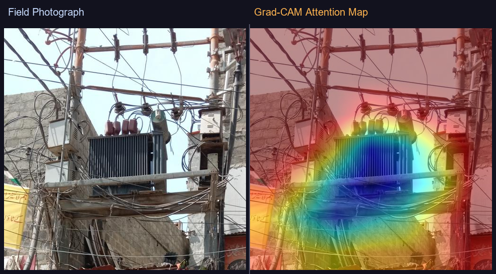
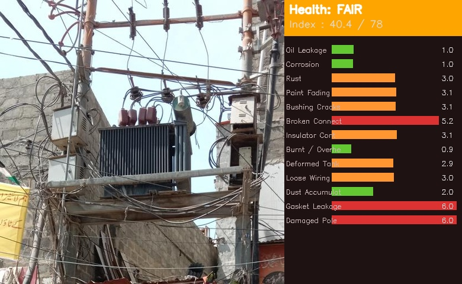
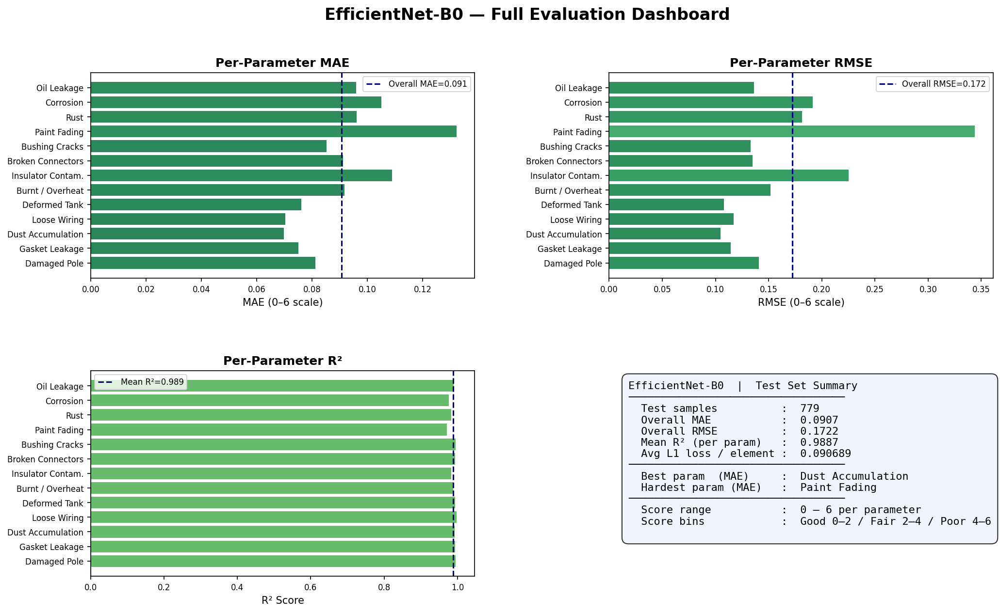
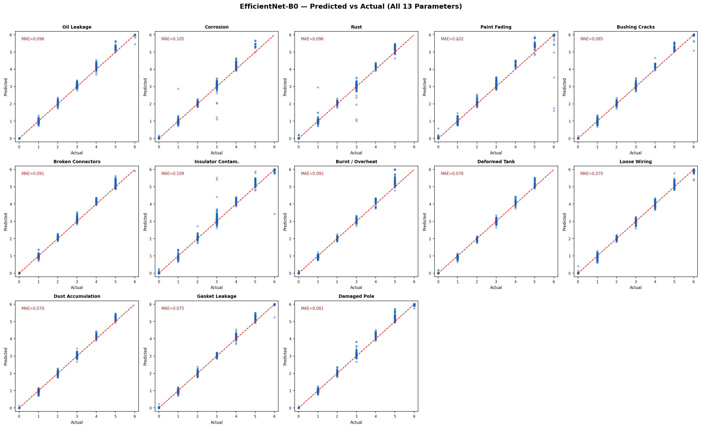
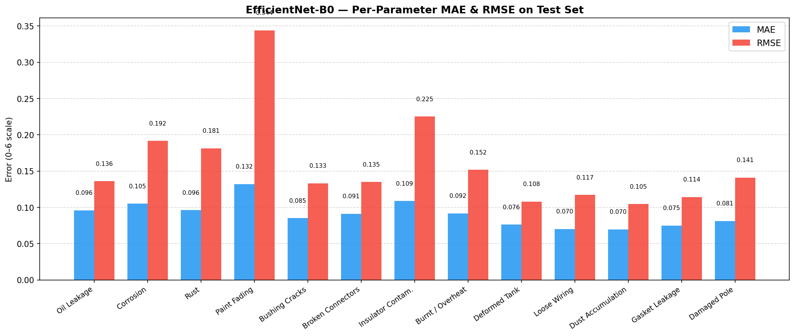
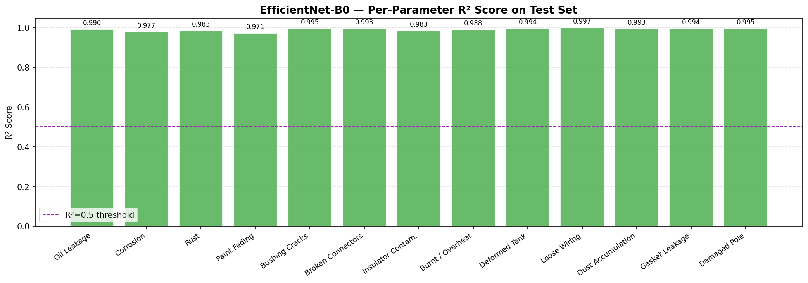
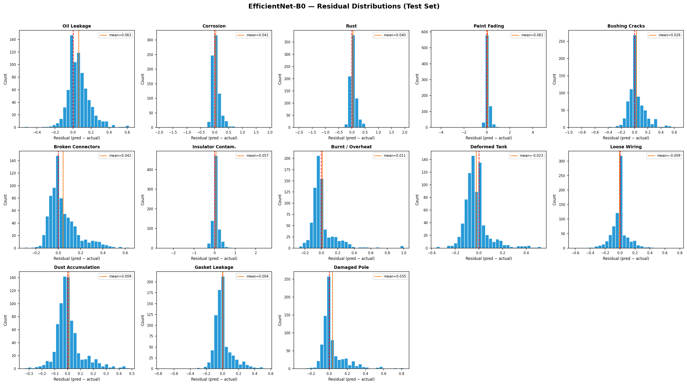
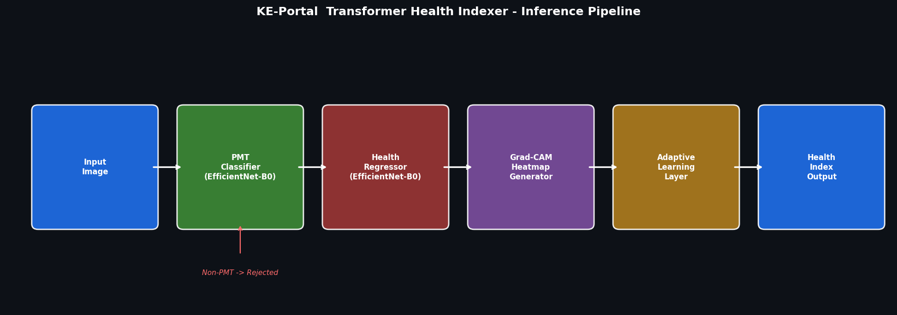

---
title: KE Portal FastAPI
emoji: ⚡
colorFrom: blue
colorTo: green
sdk: docker
app_port: 8000
pinned: false
---

<div align="center">

# ⚡ KE-Portal: Transformer Health Indexer

### AI-Powered Structural Health Assessment of Pole-Mounted Transformers

[](https://python.org)
[](https://pytorch.org)
[](https://fastapi.tiangolo.com)
[](https://nextjs.org)
[](https://flutter.dev)
[](LICENSE)

**Final Year Project · Department of Computer Science · NED University of Engineering and Technology**

[📄 Full Report](FYP_Final_Report.pdf) · [🚀 Quick Inference](#-quickstart--inference) · [🌐 Deploy Live](DEPLOYMENT.md) · [📊 Benchmarks](#-engineering-highlights--benchmarks)

</div>

---

## Visual Proof

<div align="center">

### Field Photo → Grad-CAM Attention Analysis



*Left: raw field photograph of a pole-mounted transformer.
Right: Grad-CAM heat-map from EfficientNet-B0 — warmer colours highlight regions with the highest predicted structural defect severity.*

---

### Live Inference Output Card



*Annotated result card: per-parameter defect bars, overall Health Index, and GOOD / FAIR / POOR grade.*

</div>

---

## 🔬 Research Summary

This system solves a critical infrastructure challenge: **automated, non-invasive health assessment of pole-mounted power transformers (PMTs)** from field photographs. Manual inspection is infrequent, inconsistent, and unable to scale across large distribution networks.

**The pipeline:**
1. A **PMT Classifier** (EfficientNet-B0) filters non-transformer images before any expensive computation.
2. A **Health Regression Model** (EfficientNet-B0, 13-output head) simultaneously estimates severity of 13 structural defect parameters on a **0–6 point scale**.
3. **Grad-CAM** localises the defect region, providing explainable AI (XAI) evidence for technicians.
4. An **Adaptive Feedback Layer** learns from technician corrections in deployment, continuously improving accuracy.

**13 assessed defect parameters:**
> Oil Leakage · Corrosion · Rust · Paint Fading · Bushing Cracks · Broken Connectors · Insulator Contamination · Burnt / Overheating · Deformed Tank / Bent Fins · Loose / Unsafe Wiring · Dust Accumulation · Gasket Leakage · Damaged / Bent Pole Structure

---

## 📊 Engineering Highlights & Benchmarks

### Model Performance — EfficientNet-B0, Test Set (779 samples)

| Metric | Value |
|---|---|
| **Overall MAE** (avg across 13 parameters, 0–6 scale) | **0.091** |
| **Overall RMSE** | 0.172 |
| **Mean R² Score** (per-parameter average) | **0.989** |
| Best parameter (lowest MAE) | Dust Accumulation: 0.070 |
| Hardest parameter (highest MAE) | Paint Fading: 0.132 |
| Test set size | 779 images |
| Score bins | Good (0–2) · Fair (2–4) · Poor (4–6) per param |

### System Specifications

| Specification | Detail |
|---|---|
| Framework | PyTorch 2.x · torchvision 0.24 |
| Backbone | EfficientNet-B0 (ImageNet pretrained, fine-tuned) |
| Output | 13 regression heads + scalar Health Index |
| Inference hardware | CPU-only tested (Intel Core i7) |
| Inference time | ~180 ms / image on CPU |
| Input resolution | 224 × 224 px (RGB) |
| Mixed Precision | Optional AMP FP16 for GPU deployment |
| Optimiser | Adam (lr=5×10⁻⁴, weight decay=10⁻⁴) |
| Scheduler | Cosine annealing |
| Augmentation | Horizontal flip · Rotation ±15° · Colour jitter · Random erasing |
| Early stopping | Patience = 10 epochs |

---

### Full Evaluation Dashboard



### Predicted vs Actual — All 13 Parameters



### Per-Parameter MAE & RMSE



### Per-Parameter R² Score



### Residual Distributions



---

## 🏗️ System Architecture



```
Input Image
    │
    ▼
PMT Classifier (EfficientNet-B0)
    ├── Non-PMT → Rejected
    └── PMT ──►
            Health Regression Model (EfficientNet-B0, 13 heads)
                    │
                    ├── 13 Defect Scores (0–6)
                    ├── Health Index (sum, 0–78)
                    │
                    ▼
            Grad-CAM Generator ── attention heatmap
                    │
                    ▼
            Adaptive Learning Layer ── learns from corrections
                    │
                    ▼
            Result: { scores, healthIndex, grade, gradcam }
```

### Repository Structure

```
transformer_health_index/
│
├── inference.py                  ← Standalone inference (image / folder / webcam)
├── requirements.txt              ← Python dependencies
├── environment.yml               ← Conda environment
├── Dockerfile                    ← Backend container
├── DEPLOYMENT.md                 ← Full deployment guide
├── FYP_Final_Report.pdf          ← Submitted university report
│
├── backend/                      ← FastAPI application
│   ├── api/main.py               ← REST API endpoints
│   ├── evaluate.py               ← Inference engine
│   ├── gradCam.py                ← Grad-CAM + Supabase upload
│   ├── adaptation.py             ← Adaptive learning layer
│   └── adjustment_layer.py       ← Global correction aggregation
│
├── core/                         ← Data pipeline & config
│   ├── config.py                 ← Hyperparameters & paths
│   ├── dataset.py                ← PyTorch Dataset classes
│   ├── augment.py                ← Transform builders
│   └── data_cleaning.py          ← CSV pre-processing & splits
│
├── models/                       ← Neural network architectures
│   ├── efficientnet.py           ← EfficientNet-B0 regression (13 heads)
│   ├── pmt_classifier.py         ← EfficientNet-B0 binary classifier
│   ├── resnet.py                 ← ResNet baseline
│   └── custom_cnn.py             ← Lightweight CNN baseline
│
├── frontend/                     ← Next.js 15 web portal
├── mobile_app/                   ← Flutter field application
│
├── demo/                         ← Sample transformer images for instant testing
├── docs/assets/                  ← README visuals & benchmark figures
│
├── data/
│   ├── raw/annotations.xlsx      ← Ground-truth annotation spreadsheet
│   └── processed/                ← train / val / test CSVs (auto-generated)
│
└── outputs/
    ├── checkpoints/              ← Trained model weights (.pth)
    ├── test_results/             ← Evaluation plots & metrics
    └── gradcam/                  ← Generated Grad-CAM overlays
```

---

## 🚀 Quickstart / Inference

### Prerequisites
- Python 3.10 or 3.11
- No GPU required — full CPU-only inference supported

### 3-Command Start

```bash
git clone https://github.com/anasahmed81103/FYP-CV_based_Transformer_Health_Indexer.git
cd FYP-CV_based_Transformer_Health_Indexer
pip install -r requirements.txt
python inference.py --source demo/
```

### Options

```bash
# Any single image
python inference.py --source path/to/transformer.jpg --save

# All images in a folder
python inference.py --source path/to/folder/ --save

# Live webcam (press 'q' quit, 's' save frame)
python inference.py --webcam

# Skip Grad-CAM for faster results
python inference.py --source demo/ --no-gradcam --save
```

Each result includes:
- **Health Index** (0–78; lower = healthier)
- **Grade**: GOOD / FAIR / POOR
- **13 per-parameter scores** (0–6 each)
- **Grad-CAM heatmap** (saved alongside result with `--save`)

---

## ⚙️ Full Stack Setup

### Backend (FastAPI)

```bash
# Activate venv (see Quickstart above)
python -m uvicorn backend.api.main:app --reload --host 0.0.0.0 --port 8000
# Interactive API docs: http://localhost:8000/docs
```

### Web Portal (Next.js)

```bash
cd frontend
npm install
# Set NEXT_PUBLIC_API_URL=http://localhost:8000 in frontend/.env.local
npm run dev
# Open: http://localhost:3000
```

**Demo account:** `alicena@gmail.com` / `123abcABC`

### Mobile App (Flutter)

```bash
cd mobile_app
# Edit mobile_app/.env → API_BASE_URL=http://<LAN_IP>:3000
flutter pub get
flutter run -d web-server --web-hostname 0.0.0.0 --web-port 8080
```

See [DEPLOYMENT.md](DEPLOYMENT.md) for Docker, Hugging Face Spaces, Railway, and Render.

---

## 🧠 Training from Scratch

```bash
# 1. Place raw images in data/raw/images/ and annotations in data/raw/annotations.xlsx
python core/data_cleaning.py             # generate train/val/test splits

# 2. Train health regression model
python backend/train.py

# 3. Train PMT classifier
python backend/train.py --model classifier

# 4. Evaluate
python backend/evaluate.py --model regression
python test_efficientnet_b0.py           # regenerate all benchmark figures
```

---

## 🔌 REST API Reference

| Endpoint | Method | Description |
|---|---|---|
| `/` | GET | Health check |
| `/predict` | POST | Analyse transformer images → scores + Grad-CAM |
| `/submit-corrections` | POST | Technician corrections → adaptive learning update |
| `/verify-transformer` | POST | Verify new images match stored transformer features |
| `/extract-hashes` | POST | Perceptual hash for duplicate detection |

**Example:**
```bash
curl -X POST http://localhost:8000/predict \
  -F "transformer_id=T001" \
  -F "location=Gulberg, Lahore" \
  -F "date=2026-09-16" \
  -F "time=14:30" \
  -F "files=@demo/sample_transformer_1.jpg"
```

---

## 📱 Mobile App Features

- 📷 Multi-image capture with guided overlay
- 🗺️ GPS + Reverse Geocoding (Nominatim) — auto-fills location
- 🎤 Speech-to-Text technician notes
- 📊 Historical dashboard by transformer ID
- 🔄 Submits when connectivity restores

## 🌐 Web Portal Features

- 🔐 Role-Based Access Control (Admin, Technician, Suspended)
- 📈 Analytics dashboard — health trends by zone/date
- 🔍 Per-transformer audit log with images and Grad-CAM overlays
- ⚙️ Admin panel — user management and adjustment viewer
- 🗄️ Drizzle ORM + PostgreSQL data persistence

---

## 📑 Citation

If you use this work in academic research, please cite:

```bibtex
@mastersthesis{ke_portal_2026,
  title  = {KE-Portal: AI-Driven Structural Health Indexing of
            Pole-Mounted Transformers using EfficientNet and Grad-CAM},
  author = {Anas Ahmed},
  school = {NED University of Engineering and Technology},
  year   = {2026},
  note   = {Final Year Project, Department of Computer Science}
}
```

---

## 📄 License

MIT — see [LICENSE](LICENSE)

---

<div align="center">

*Built with PyTorch · FastAPI · Next.js · Flutter*
*NED University of Engineering and Technology · 2026*

</div>
